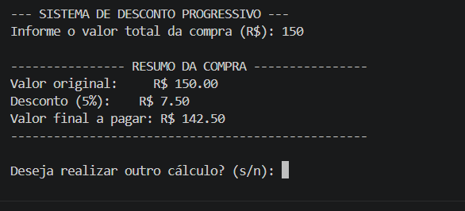
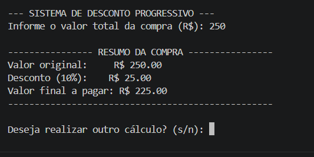
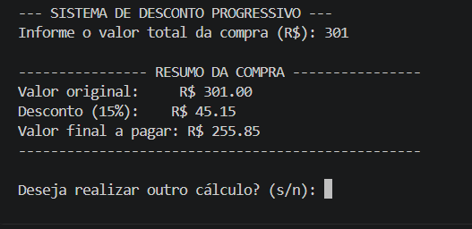

# 🛒 Sistema de Desconto Progressivo — Agenda 6

Programa em Python desenvolvido para calcular descontos progressivos em compras de uma loja online, com validação de dados em tempo de execução e interface de uso contínuo via terminal.

---

## 📏 Regras de Desconto

| Valor da Compra (R$) | Desconto (%) |
| :--- | :---: |
| **Menor que R$ 200,00** | 5% |
| **De R$ 200,00 até R$ 299,99** | 10% |
| **A partir de R$ 300,00** | 15% |

---

## 🧠 Arquitetura e Explicação do Código

O programa foi construído seguindo boas práticas de desenvolvimento (PEP 8), modularização de funções e tratamento preventivo de exceções:

- **`calcular_desconto()`**: Função responsável por processar uma única operação de compra.
  - **Tratamento de Exceções (`try / except`):** Captura erros do tipo `ValueError` caso o usuário insira valores alfanuméricos no terminal, impedindo o encerramento inesperado do script.
  - **Validação Lógica:** Garante que valores negativos não sejam processados.
  - **Condicionais Otimizadas (`if / elif / else`):** Avalia as faixas de preço de forma encadeada, aplicando a porcentagem exata de desconto sobre o valor total.
  - **Formatação de Moeda:** Exibe os resultados formatados com duas casas decimais (`:.2f`).

- **Ciclo Principal de Execução (`while True`)**: 
  - Mantém a aplicação rodando continuamente para permitir múltiplos cálculos sucessivos.
  - Conta com um laço interno de validação estrita para a pergunta de continuidade (`s/n`), forçando o usuário a fornecer uma entrada válida antes de prosseguir ou encerrar com a função `exit()`.

---

## 📸 Evidências de Testes

### 🔹 1. Teste — Desconto de 5% (< R$ 200,00)
> **Entrada:** `R$ 150,00` | **Desconto:** `R$ 7,50` | **Total:** `R$ 142,50`

---

### 🔹 2. Teste — Desconto de 10% (R$ 200,00 a R$ 299,99)
> **Entrada:** `R$ 250,00` | **Desconto:** `R$ 25,00` | **Total:** `R$ 225,00`

---

### 🔹 3. Teste — Desconto de 15% (≥ R$ 300,00)
> **Entrada:** `R$ 301,00` | **Desconto:** `R$ 45,15` | **Total:** `R$ 255,85`

---

## 🔗 Link do Repositório Completo

- **Repositório:** [Acessar Projeto no GitHub](https://github.com/seu-usuario/seu-repositorio)

---

## 🛠️ Tecnologias
- **Python 3**
- **Git / GitHub**